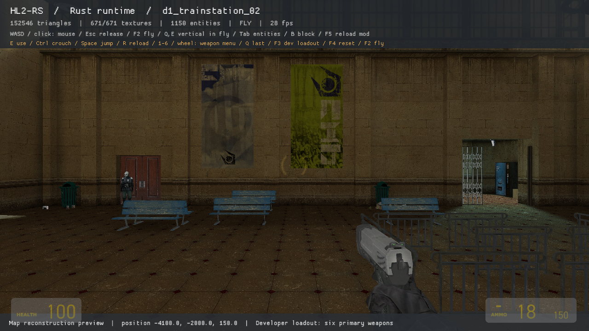

# HL2-RS

A standalone, partial Rust reconstruction of Half-Life 2 that reads maps, models, textures, animations and sounds from an installed copy. It does not load Valve's game or engine DLLs. The full campaign is not playable yet.



Capture from the packaged Rust build on `d1_trainstation_02`, with F1 diagnostics and a developer weapon loadout. This is a rendering preview, not evidence of completed campaign gameplay. The screenshot depicts owned HL2 content; distributable game assets are not included.

## Build a fresh checkout

You need an owned, installed Steam PC copy of Half-Life 2, Windows 64-bit, Rust stable with the MSVC toolchain, and Visual Studio C++ build tools with a Windows SDK. The renderer uses OpenGL; GPU and RAM minimums have not been measured. Other operating systems are unverified.

The tested installation is Steam app 220, build `19307283`, patch `9912070`. Other game builds are unverified. Rust `1.99.0` was used for the recorded Windows checks. Cargo resolves the library versions in `Cargo.lock`; no external mod, loader or Source engine runtime is needed.

```powershell
git clone https://github.com/kvalls/hl2-rs.git
cd hl2-rs
.\scripts\build.ps1
.\launch.cmd
```

The repository contains source, not a prebuilt executable. Building creates `bin/hl2-rs.exe`. If PowerShell blocks the local build script, invoke `powershell -NoProfile -ExecutionPolicy Bypass -File .\scripts\build.ps1` for that process. To uninstall, remove the checkout; the game installation is read-only.

## Play the current build

Double-click `launch.cmd` in this folder. It launches `bin/hl2-rs.exe`, the packaged release build. Rust is needed only for rebuilding. The default map is `d1_trainstation_02`, and the default mod configuration adds no sandbox blocks.

```powershell
.\launch.cmd --map d1_trainstation_01
.\launch.cmd --map d2_coast_03
.\launch.cmd --game 'C:\Program Files (x86)\Steam\steamapps\common\Half-Life 2'
.\launch.cmd --mods mods/sandbox.json
```

Steam libraries are discovered automatically; `HL2_ROOT` can override discovery. Original assets are read in place. There are no bundled game assets, decompiler tools or native game DLLs in the runtime. No FAL account or credits are needed.

| Control | Action |
| --- | --- |
| WASD / mouse | Move / look; click to capture mouse, Escape to release |
| Space / Ctrl | Jump / crouch |
| Shift / Alt | Sprint / walk slowly |
| E | Use a door or button within reach |
| Left click / R | Attack / reload |
| Right click with shotgun | Double shot; one remaining shell falls back to a single shot |
| 1–6 / mouse wheel | Open/cycle owned weapons by stock slot and position |
| Left/right click while selecting / Escape | Confirm without firing / cancel |
| Q while walking | Switch to the previous usable weapon |
| F3 | Developer loadout: crowbar, pistol, .357, SMG1, AR2, shotgun, reserves and suit |
| F1 | Toggle the development overlay; hidden by default |
| Middle mouse | Apply a test impulse to a nearby prop |
| F2 / Q / E | Toggle flight / rise / descend while flying |
| F4 | Reset player to the map spawn |
| F5 / Tab | Reload JSON mod / toggle entity markers |
| B / Backspace | Place / remove a sandbox block |
| F12 / F10 | Save screenshot and camera / quit and write runtime report |

The starting map normally has no player weapon. F3 is a test aid. It does not demonstrate campaign weapon acquisition. Some campaign scripts still block progression.

## Implemented so far

- Read-only VPK v1/v2 and loose content mounting, map ZIP content, custom content directories/VPKs, CRC checks, bounded readers.
- BSP 19/20 and compressed lumps, world geometry, brush submodels, displacement geometry and collision, duplicate entity outputs.
- VMT patch includes, VTF decoding, primary baked lightmap atlases, opaque/cutout/translucent/additive materials, basic two-texture scrolling and entity tint. Six-face LDR sky backgrounds use installed textures/transforms and separate 2D/3D leaf visibility. Lighting remains approximate.
- MDL/VVD/VTX meshes, skins, static props and selected entity models. Bone hierarchies, skinning, selected compressed MDL/ANI clips and bounded sequence-event decoding; viewmodel sound events play at their recorded cycles.
- Fixed 15 ms movement with acceleration, friction, gravity, air movement, jump, crouch, sliding and stepping. Collision uses world/terrain/prop shapes; it is not Source prediction or exact collision equivalence.
- Rapier rigid props and collision, moving door transforms, interaction and prop impulses. Prop shapes are derived from render meshes, with approximate mass/material properties.
- Timed entity I/O, target lookup, relays, counters, branches, cases/shuffling, timers, player triggers, doors and a subset of scripted sequences. Unsupported inputs are logged.
- Crowbar, pistol, .357, SMG1, AR2 and shotgun primary attacks, shotgun secondary attack, installed scripts/viewmodels, separate reserves, magazine reloads and shell-by-shell shotgun reload/pump/interruption. Secondary fire consumes two shells and fires twelve pellets; reload interruption retains a delayed shot after release. Crowbar traces use the Source ray/hull/corner sequence with approximate Rapier geometry. NPC models can animate and take damage, but do not implement combat AI.
- Resource-driven PC weapon selection, health/suit/ammunition animation rules, low-health pulse loops, QuickInfo brackets/progress/fades/warning sounds, installed fonts and rounded corners. Layout, font-cell scaling and input behavior are compared with selected retail HUD methods and original-engine captures; exact native font rasterization is not reproduced.
- Supported PCM WAV ambient/event/weapon audio and map changes through `trigger_changelevel`, with landmark-relative player position and preserved inventory.
- Common world/mod interfaces in `modkit-core`, with a reloadable JSON sandbox. No crossovers are integrated.

## Fidelity work remaining

This is not a completed rewrite of Source. Major gaps include NPC navigation/schedules/combat, other secondary attacks/projectile weapons and the remaining arsenal, recoil/muzzle flashes/tracers/shell ejection, exact prediction spread and shotgun pellet hull traces, player damage/death, vehicles, save/load, campaign state transfer, VCD choreography/dialogue/lip sync, non-sound animation events/blends/IK/flexes, ragdolls and PHY collision shapes, moving-platform behavior and blocked-door handling. Scripted movement and parenting/attachments are incomplete. HUD damage-message dispatch, secondary ammo/history/aux-power panels, zoom/convar gates and additional VGUI animation commands remain unfinished.

Water/ladders, surface movement modifiers, exact crouch transitions and prediction need further work. The renderer lacks Source's full lighting/material system: HDR/exposure, bump/normal/specular shading, light probes, shadows, cubemaps, sky polygon masking, sky fog, fog, water/refraction, dynamic lightstyles and many material proxies. Audio lacks spatial mixing, soundscapes, DSP, HEV sentence scheduling and unsupported compressed formats. Content mounting is not a general `gameinfo.txt` implementation. Supported map loading does not prove that a map's gameplay works.

## Rebuild and inspect

With Rust stable, rustfmt, Clippy and Visual Studio C++ tooling installed, rebuild using:

```powershell
.\scripts\build.ps1
cargo test --workspace --locked
cargo clippy --workspace --all-targets --locked -- -D warnings
cargo fmt --all --check
.\bin\hl2-rs.exe inspect --map d1_trainstation_02 --output artifacts/inspect.json
.\bin\hl2-rs.exe verify --all --output artifacts/verification.json
.\bin\hl2-rs.exe view --frames 90 --smoke --capture artifacts/smoke.png
```

`build.ps1` replaces the executable used by `launch.cmd`; changing source or committing it does not rebuild that executable. Use `-DebugBuild` only when deliberately packaging a debug build. `bin/build-info.json` records the packaged executable's fingerprint when built with the script.

`export` writes a local game-derived world; keep those exports local. Runtime captures/reports are written in ignored `artifacts/`. The two licenses in `third_party/miniquad` cover the vendored Rust window/input dependency, including its Windows absolute-mouse fix.

## Research boundary

The separate native research folder for this checkout is `../../work/hl2-decompiled`. Its private binary copies, Ghidra databases, C pseudocode, indices and research scripts are outside this project. It is a reference for implementing behavior; none of its native code is loaded or compiled into the Rust runtime. Native exports are approximate pseudocode, not recovered original source.

Development used the universal-modder Codex plugin and ten skills, version 0.2.0. They are not runtime or build dependencies. Its FAL capabilities are unused. The requested three reference repositories were read and are recorded in [research](docs/research.md). See [validation](docs/validation.md) for concrete checks and [MODLOG](MODLOG.md) for implementation notes.

This is an AI-assisted project developed with OpenAI Codex and GPT-6, with original-game testing and manual review of selected native behavior. It remains an experimental reconstruction. Contributions are welcome; read [CONTRIBUTING](CONTRIBUTING.md) for the code boundaries, checks and useful evidence to include in a PR.

Original project code is MIT licensed. Installed assets and private analysis retain their own rights and are excluded from Git. Dependencies retain their own licenses.


## Current weapon and sky iteration

The PC selector follows the installed resources and reviewed `CHudWeaponSelection` behavior: five small slot boxes and one expanded column, only selected-item text, stock colors/corners, wheel cycling, either mouse button to confirm, Escape to cancel and Q for the previous weapon in walk mode. Empty slots retain their box without a number. It starts its inactivity fade after 0.5 seconds and closes after 1.25 seconds. Confirming consumes attack input. The six implemented primary weapons use separate ammunition and reload state; switching cancels an incomplete reload.

SMG1 and AR2 empty fire now follows the reviewed base-weapon latch: the first empty attempt clicks without changing the animation or attack deadline, and the next attempt tries reload. Empty sounds have separate per-weapon 0.5-second throttles; idle automatic reload waits until the primary deadline has elapsed. Next-best-weapon autoswitch, secondary cooldown rules and custom no-auto-reload flags remain unfinished.

The world camera converts HL2's 75-degree horizontal field of view at 4:3 into vertical field of view; the viewmodel keeps its separate 54-degree reference. Development banners are hidden by default and can be toggled with F1.

`--input-script <JSON>` drives timed regression actions through the normal runtime handlers and records them in the runtime report. Captures use simple filename stems under `artifacts/`. `--time-scale 0.1` slows simulation for manual HUD/input checks; normal play defaults to 1. These test options do not establish full original-game equivalence.

Run `.\launch.cmd --input-script test-inputs/weapons-hud.json` for the approximately 41-second weapon/HUD regression after the map loads. It supplies a test loadout, selects/fires/reloads the six supported weapons, checks selector confirmation/cancellation/timeout, hits the floor with the crowbar and empties/reloads the SMG. It exits automatically and writes captures and `artifacts/runtime-report.json`.

Run `.\launch.cmd --input-script test-inputs/shotgun-secondary.json` for a nine-second secondary-fire regression. It checks held right-click confirmation, double fire and cooldown, one-shell fallback, and reload interruption with release before the delayed shot. Both fixtures overwrite the same runtime report; save it before another run if needed.

Run `.\launch.cmd --input-script test-inputs/selection-held.json` for held-button selection, independent button rearming and an ordered release/repress in one input poll. These captures and reports also stay in ignored `artifacts/`.

Crowbar flesh/world impacts use their distinct script sounds, and symbolic sound playback retains all `rndwave` alternatives instead of discarding all but the first. Surface impact marks use installed concrete/metal/wood/glass textures, are clipped to receiver triangles and follow moving props/doors. Their rendering approximates DecalModulate; NPC blood decals, layered fading and exact Source surface response remain unfinished.

Health kits, health vials and batteries play their own installed pickup sounds when accepted. Full health/armor leaves the item in place, and a battery requires a suit. Suit logon sentences are still missing.

BSP leaves and compressed PVS identify the miniature 3D sky area. Its scenery uses the map's sky-camera origin/scale and renders before the playable world with a separate depth clear, only when the camera leaf has the `LEAF_FLAGS_SKY` visibility flag. The six-face LDR background draws first, without depth writes, when either the 2D or 3D sky bit is present. Opaque map geometry still occludes both passes. The patched OpenGL backend tests opaque depth for translucent/additive surfaces independently of their depth-write mask. Matched trainstation captures verify that hidden light shafts, entrance pillars and barrier effects no longer draw over the intervening wall; visible entrance pillars remain. General PVS/areaportal culling, native sky polygon masks, HDR, sky fog and multiple sky cameras remain unfinished.

Player hull queries exclude NPC-only clip brushes. This corrects oversized invisible blockers around the station benches while retaining their visible-model collision. Prop physics still uses approximate render-derived shapes; native PHY shapes remain separate work.

Grounded crouch now crops movement commands independently of maximum speed, preserving the reviewed jump-boost cap. Air crouching retains full air acceleration. Released jumps can chain without an added ground-friction tick in controlled tests. Exact crouch/suit transitions and original-game movement over campaign geometry still need comparison.
